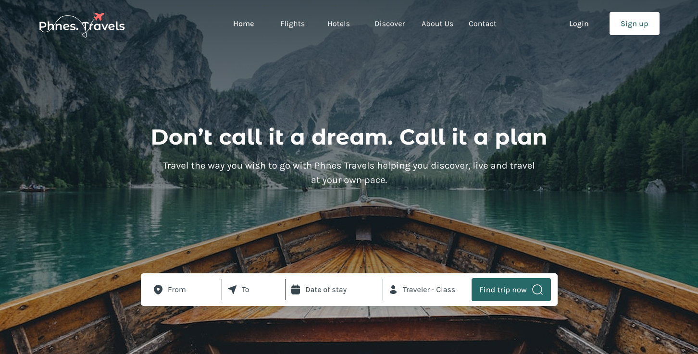

# ✈️ Phnes Travels — Modern Travel Agency Landing Page

A responsive and accessible **travel agency landing page**, built using **HTML**, **CSS**, and **JavaScript**.  
This project was created as a portfolio piece to demonstrate skills in layout, design integration, and semantic frontend development.

## 🔍 Live Demo

👉 [View live on GitHub Pages](https://levkravtsov-dev.github.io/phnes-travels/)

---

## 🚀 Features

- 📱 Fully responsive for mobile, tablet, and desktop
- 🎨 Pixel-perfect layout based on Figma design
- 🌐 Semantic HTML structure
- 🔍 SEO optimization: meta tags, correct heading levels, alt texts
- 🧭 Navigation menu with burger menu for mobile
- ✨ Subtle animations and interactive UI
- 🔧 Clean, scalable code with comments

---

## 🛠️ Technologies Used

- **HTML5** – semantic and accessible markup
- **CSS3** – custom styling, flex/grid layout
- **JavaScript** – mobile menu logic, interactivity
- **Figma** – design reference

---

## 📂 Structure
phnes-travels/
├── index.html
├── css/
│ ├── style.css
│ ├── media.css
│ └── reset.css
├── js/
│ ├── main.js
│ └── swiper.js
├── images/
└── README.md

---

## 👨‍💻 About Me

I’m **Lev Kravtsov**, a  full-stack developer learning every day.  
Currently mastering **JavaScript** and **WordPress**, and building a portfolio to grow as a freelancer.

- 🌍 [LinkedIn](https://www.linkedin.com/in/lev-kravtsov-96a6812b4/)
- 💼 [Upwork](https://www.upwork.com/freelancers/~0166f57eef68c0685b)
- 🧑‍💻 [GitHub](https://github.com/levkravtsov-dev)

---

## 📌 Notes

> This project was built without build tools (no dist), to keep it as clean and transparent as possible for learning and reviewing purposes.

---

## 📫 Feedback & Collaboration

Feel free to connect with me for feedback, collaboration, or just to say hi!

